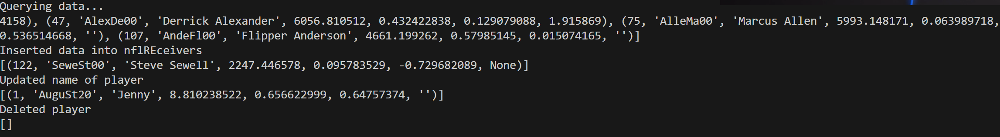
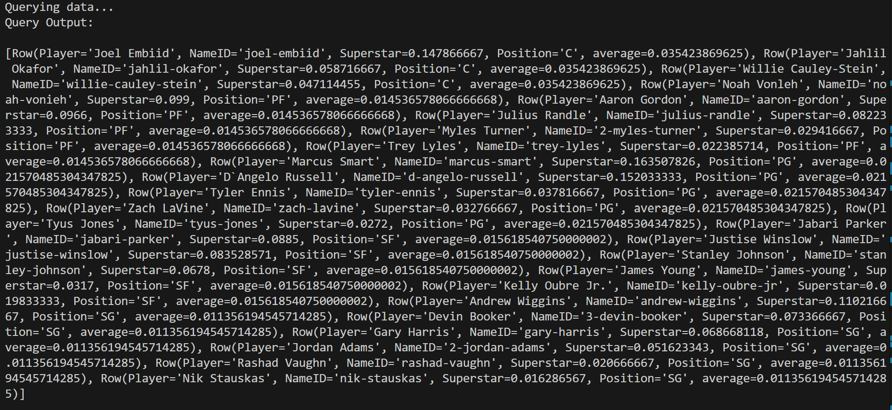

# Databricks Integration

This project creates an ETL-Query pipeline utilizing a cloud service like Databricks, and performs CTE and aggregation operations to analyze the data. The  is imported as a csv and loaded into Databricks as jdc_draft_2015; it contains historical results of the NBA draft projection model, 2001-2015.

[](https://github.com/nogibjj/jdc154_mini_6/actions/workflows/hello.yml)

## Functionality and commands:
* ETL - extracts data from url (extract.py), transforms data for analysis, and loads data into Databricks SQL Warehouse (transform_load.py). This is accomplished by establishing a database connection to Databricks.
* Performs complex queries like joins and aggregation. (query.py)
* Tests each operation
* CI/CD pipeline (github actions including secrets)
* requirements.txt
* Makefile
* Dockerfile and devcontainer
* main.py - script to run ETL and query 
* test_main.py - test script 

## Visualization of Process:


## Preparation and usage
1. Open codespaces 
2. Load repo to code spaces
3. Wait for installation of all requirements in requirements.txt
4. Make your own .env file to store your Databricks' secrets as it requires a conncection to be established to Databricks
3. Run main.py to load in database and run queries

## Check format and test errors
1. Format code `make format`


2. Lint code `make lint`


3. Test code `make test`


(alternatively, do all with `make all`)

## Query Explanation:
```sql

    WITH av_super AS (
    SELECT Position, AVG(Superstar) as average
    from jdc_draft_2015
    GROUP BY Position
    )

    SELECT p.Player, p.NameID, p.Superstar, p.Position, a.average
    FROM jdc_draft_2015 p 
    JOIN av_super a 
    ON p.Position = a.Position
    WHERE Superstar > a.average
    ORDER BY Position, Superstar DESC

```
This query uses a CTE (common table expression) to get the average robability of becoming a superstar player per position. I then join this with my main table, comparing each player's probability of becoming a superstar to their position's average, and only display players who have a probability higher than the average of their position. I then display the player in order by position and their superstar probability. 




